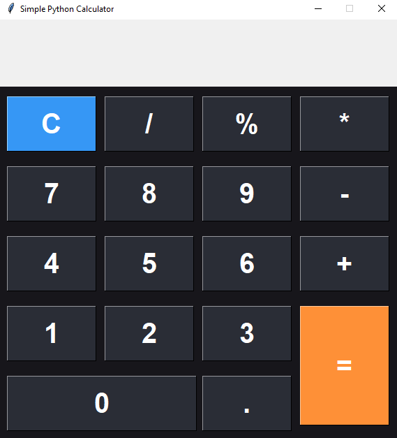

# Project Title
Simple Calculator by Python

# Getting started

<ul> 
<li> This Program run on both Windows and Linux operating system by using pycharm or all other python editor with the python version 3.x  </li>
<li> This software is developed by python 3.x </li>
<li> Used tkinter module for the Graphical User Interface. </li>
<li> It performs  Addition, Subtraction, Multiplication and Division only for two numbers. </li>
<li> It is more secure which means you may not enter other anything except the numerical values. </li>
<li> It is more relevant and easy to use for an user. </li>
</ul>

# Prerequisites

For Windows

<ul>
<li>You need to install python version 3.x. you may download Python version from their official website: ../ https://www.python.org/downloads/  
</li>
</ul>

For Linux

<ul> 
<li> To install both python and any text editor like pycharm you should do some execution of command line on the terminal.  </li>

</ul>

# Built in
<ul> <li> python 3.x   </li> <li> tkinter python   </li> </ul>

# How to use calculator

To use Calculator, you just need to enter a valid math expression using your mouse and then press Enter or click on the = sign:

